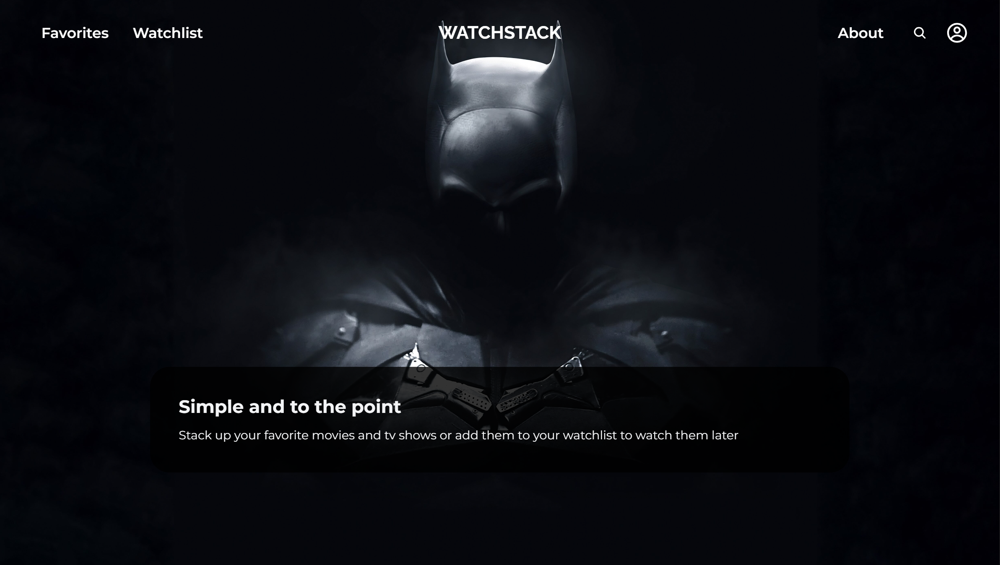
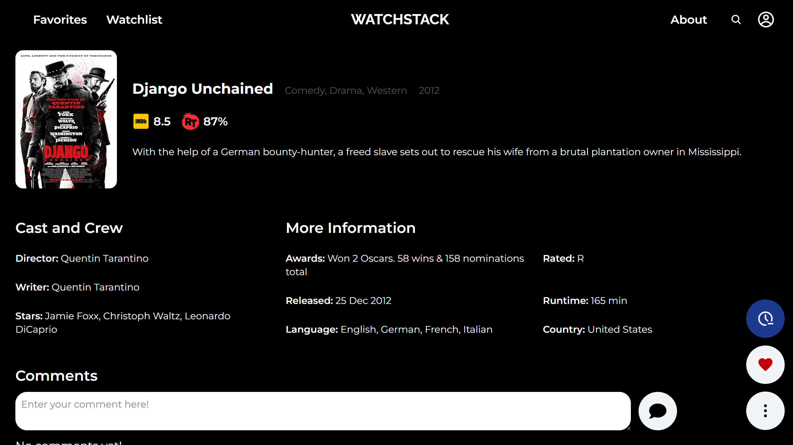
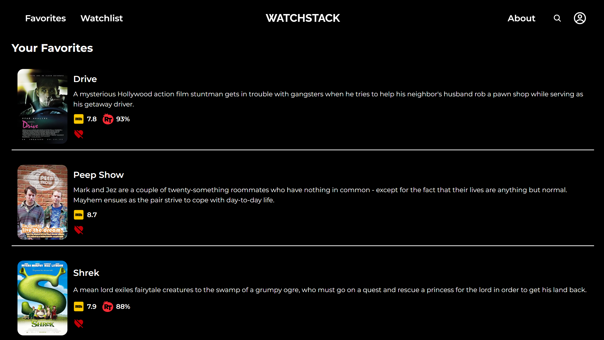
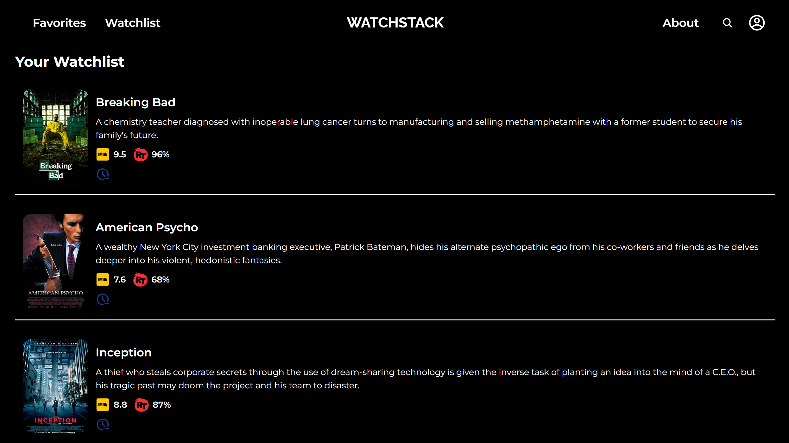
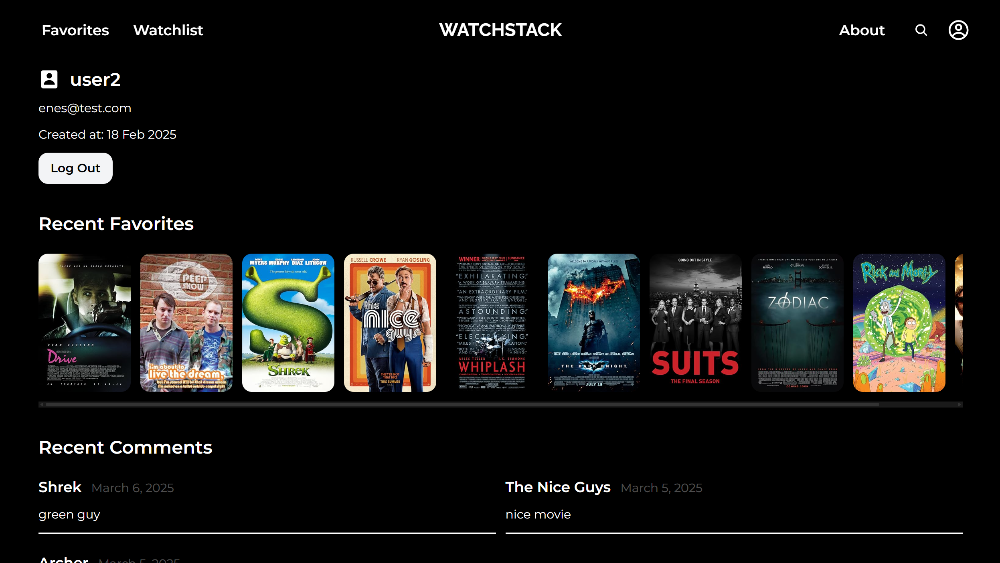

# WatchStack 







**WatchStack** is a movie and TV show tracking platform inspired by Letterboxd. Users can browse movies and TV shows, leave comments, add them to their favorites or watchlist, and see other users' activity.

## Features
- 🔎 **Browse Movies & TV Shows** – Discover a wide range of content.
- 💬 **Comment System** – Share your thoughts on movies and shows.
- ⭐ **Favorites & Watchlist** – Keep track of what you love and what you plan to watch.
- 👥 **User Activity Feed** – Stay updated with what others are watching.
- ⚡ **Fast Data Fetching** – Optimized API calls using React Query.
- 🔗 **Seamless Navigation** – Powered by React Router DOM.

## Tech Stack
- **Frontend:** React, Vite, Tailwind CSS
- **State & Data Fetching:** React Query
- **Data From:** OMDb API
- **Routing:** React Router DOM
- **Backend:** Firebase (Authentication, Database, Storage)

## Installation

Clone the repository:

```bash
git clone https://github.com/benenesgunes/watchstack.git
```
Navigate into the project directory:

```bash
cd watchstack
```
Install dependencies:
```bash
npm install
```
Start the development server:
```bash
npm run dev
```
## Usage

- 🔎 **Search** for movies and TV shows.
- 💬 **Comment** on titles and engage with the community.
- ⭐ **Add** movies/shows to your **favorites** or **watchlist**.
- 👥 **View activity** from other users.

## License

This project is a nonprofit, solo initiative and is licensed under the MIT License.

## Contributing

As this is a solo project, contributions are not currently being accepted, but feel free to open an issue if you encounter any bugs.
